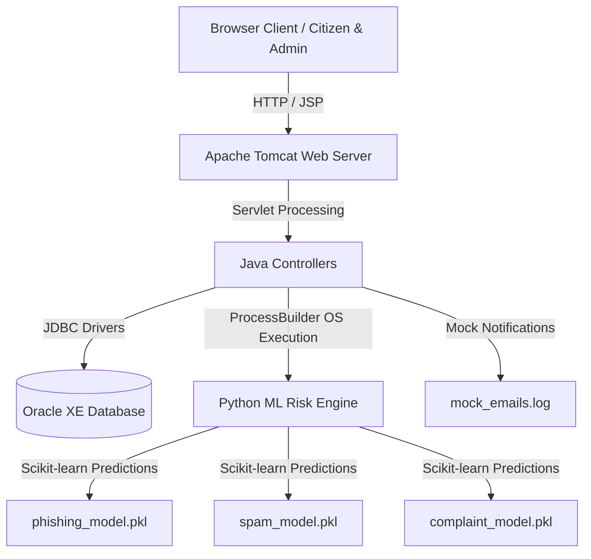
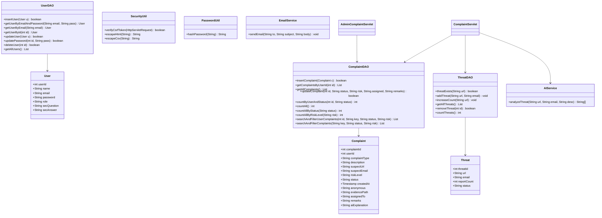
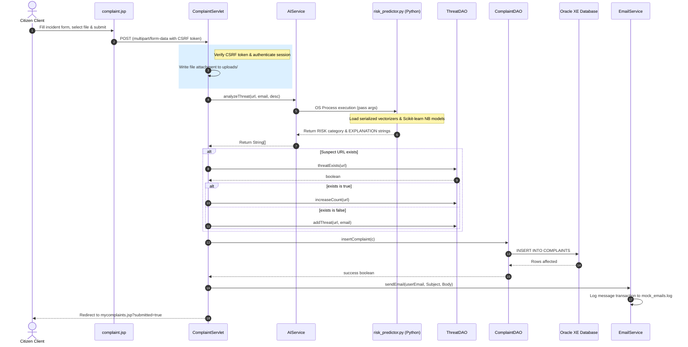
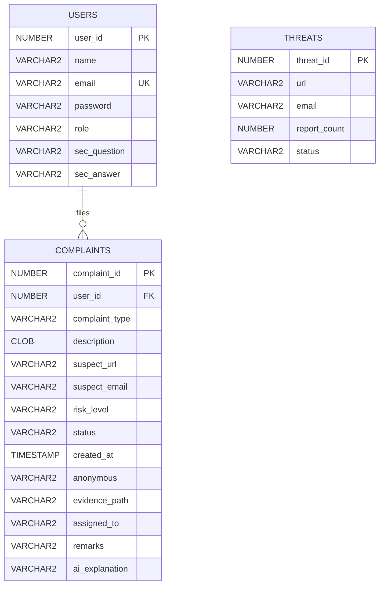

# CyberShield: Smart Cybercrime Complaint & Threat Reporting System
## Comprehensive Project Documentation & Technical Handbook

---

## 1. Executive Summary
**CyberShield** is an advanced web-based cybercrime reporting, tracking, and threat intelligence system. It combines a dynamic Java EE servlet-based web layer, a secure Oracle database, and a Python machine learning engine using **Scikit-learn** for real-time risk assessment and threat intelligence. 

The system distinguishes between three actor profiles (Guest, Citizen User, Administrator) and delivers critical tools including evidence file uploads (screenshots, PDFs), case management, duplicate scam reporting, automated email dispatch simulation, and visual analytics dashboards.

---

## 2. System Architecture



---

## 3. Unified Modeling Language (UML) Diagrams

### 3.1 Use Case Diagram
```mermaid
left_to_right_direction
actor Guest
actor Citizen as "Citizen User"
actor Admin as "System Administrator"

rectangle CyberShield {
    Guest --> (Register Account)
    Guest --> (Login Session)
    
    Citizen --> (Login Session)
    Citizen --> (Report Incident & Upload Evidence)
    Citizen --> (Search & Filter Own History)
    Citizen --> (Track Status on Timeline)
    Citizen --> (Manage Profile & Reset Password)
    
    Admin --> (Login Session)
    Admin --> (Monitor Dashboard & Charts)
    Admin --> (Search & Filter All Complaints)
    Admin --> (Assign Investigator & Remarks)
    Admin --> (Manage Registered Citizens)
    Admin --> (Purge Threat intelligence Records)
    Admin --> (Export CSV/Excel & Print PDF Reports)
}
```

### 3.2 Class Diagram


### 3.3 Sequence Diagram: Incident Submission & Processing


---

## 4. Entity-Relationship (ER) Diagram



---

## 5. Artificial Intelligence (AI) Module

The Python AI module utilizes **Scikit-learn** algorithms trained on incident characteristics to calculate threat risk categorizations and produce diagnostic reports.

1. **Phishing Website Classification**: Trains a TF-IDF vectorizer + Multinomial Naive Bayes model to distinguish high-risk scam domain words (e.g. "secure-paypal-login") from reputable sites.
2. **Spam Email Classifier**: Analyzes sender email and header text against phishing and advertising corpora.
3. **NLP Crime Description Analyzer**: Classifies incident logs into Low, Medium, or High categories (e.g., enterprise hacking demands evaluate to High; credit card issues to Medium; safety questions to Low).
4. **Aggregated Decision Engine**: Combines categorical prediction variables with structural criteria (e.g., lack of SSL/HTTPS protocol) to generate the final risk classification and output a plain-language diagnostics summary.

---

## 6. Security Architecture Report

- **Password Hashing**: Cryptographic password protection implemented via **SHA-256**. All authentication updates hash passwords. Logins run a backwards-compatible mechanism verifying matches against both the hashed string and old plaintext.
- **SQL Injection Prevention**: Completely mitigated. Every database insert, update, search, and delete query utilizes parameterized SQL bindings via JDBC `PreparedStatement`.
- **Cross-Site Scripting (XSS)**: High-risk user fields are filtered via `SecurityUtil.escapeHtml()` prior to rendering inside JSP pages.
- **Cross-Site Request Forgery (CSRF)**: Random UUID security tokens are assigned on session initialization. All state-changing actions (POSTs) require form verification matching the session tokens.
- **Session Lifecycles**: Citizen and Admin active sessions automatically timeout after 15 minutes of inactivity.

---

## 7. Testing & Quality Assurance

| Test ID | Module | Scenario | Expected Outcome | Status |
|---|---|---|---|---|
| TC-01 | Auth | User Registration with Security Recovery Questions | Password is saved as SHA-256 hash; sec questions saved in database. | Passed |
| TC-02 | Auth | Login using Plaintext & Hashed Passwords | Login succeeds for both old plain credentials and new hashed ones. | Passed |
| TC-03 | User | Incident Reporting with Evidence Attachment (PDF) | PDF uploaded to context `uploads/` directory; file path saved. | Passed |
| TC-04 | AI | Incident Classification and explanation execution | Correctly assigns risk (e.g., High) and logs structural explanations. | Passed |
| TC-05 | Admin | Filter pipeline and commit updates | Updates status, risk, and investigator assignment in the database. | Passed |
| TC-06 | Admin | Export spreadsheet (CSV) & print PDF report | Generates `.csv` download and triggers browser Print layout. | Passed |
| TC-07 | Security | Submit form with missing/invalid CSRF token | Server returns `403 Forbidden` error. | Passed |
| TC-08 | Email | Simulated Email dispatch on status change | Status changes append transaction logs in `mock_emails.log`. | Passed |

---

## 8. Deployment Guide

### Prerequisites
- **Java SE Development Kit 17** (or above)
- **Apache Tomcat 10.1**
- **Oracle XE Database 11g/12c/18c/21c**
- **Python 3.10+** (with packages `scikit-learn` installed)

### Database DDL Setup
Execute the following statements in SQL*Plus or Oracle SQL Developer:
```sql
CREATE TABLE USERS (
    USER_ID NUMBER GENERATED BY DEFAULT AS IDENTITY PRIMARY KEY,
    NAME VARCHAR2(100) NOT NULL,
    EMAIL VARCHAR2(100) UNIQUE NOT NULL,
    PASSWORD VARCHAR2(100) NOT NULL,
    ROLE VARCHAR2(20) NOT NULL,
    SEC_QUESTION VARCHAR2(255),
    SEC_ANSWER VARCHAR2(255)
);

CREATE TABLE COMPLAINTS (
    COMPLAINT_ID NUMBER GENERATED BY DEFAULT AS IDENTITY PRIMARY KEY,
    USER_ID NUMBER NOT NULL,
    COMPLAINT_TYPE VARCHAR2(100) NOT NULL,
    DESCRIPTION CLOB NOT NULL,
    SUSPECT_URL VARCHAR2(500),
    SUSPECT_EMAIL VARCHAR2(200),
    RISK_LEVEL VARCHAR2(20),
    STATUS VARCHAR2(50),
    CREATED_AT TIMESTAMP(6) DEFAULT CURRENT_TIMESTAMP,
    ANONYMOUS VARCHAR2(10),
    EVIDENCE_PATH VARCHAR2(1000),
    ASSIGNED_TO VARCHAR2(100),
    REMARKS VARCHAR2(2000),
    AI_EXPLANATION VARCHAR2(2000),
    FOREIGN KEY (USER_ID) REFERENCES USERS(USER_ID)
);

CREATE TABLE THREATS (
    THREAT_ID NUMBER PRIMARY KEY,
    URL VARCHAR2(500),
    EMAIL VARCHAR2(200),
    MESSAGE_HASH VARCHAR2(200),
    REPORT_COUNT NUMBER DEFAULT 1,
    STATUS VARCHAR2(50) DEFAULT 'ACTIVE'
);

CREATE SEQUENCE THREAT_SEQ START WITH 1 INCREMENT BY 1;
```

### Steps to Deploy
1. Compile the Java files to output directory `build/classes`.
2. Move the web app context structure (JSPs, libraries, compiled classes) into the Tomcat `webapps/CyberShield/` directory.
3. Open `DBConnection.java` and adjust database password configuration if needed, then compile.
4. Execute `python AI/train_models.py` in the workspace folder to serialize the machine learning models.
5. Launch Tomcat and navigate to `http://localhost:8080/CyberShield/`.

---

## 9. Batch 1 Feature Addition (Feedback, Complaint Categories, Suspect Repository, Learning Corner)

This adds four feature groups on top of the base system described above.
**Run `db_migration_batch1.sql` against your existing schema before deploying**,
then recompile all Java sources (the previous `build/classes` output has been
cleared since it predates these changes).

### 9.1 Complaint category restructure
`complaint.jsp` now asks for a top-level **registration category** first —
*Women & Child Related Crime*, *Financial Fraud*, or *Other Cybercrime* —
then a dependent **specific incident type** dropdown (populated client-side
via JavaScript based on the chosen category). Both are stored: `COMPLAINT_TYPE`
holds the top-level category, and the new `SUB_TYPE` column holds the specific
type. `mycomplaints.jsp` and `admin/complaints.jsp` display both.

### 9.2 Feedback
A public `feedback.jsp` (usable by guests and logged-in citizens alike) collects
a name/email, category, 1–5 star rating, and message into the new `FEEDBACK`
table via `FeedbackServlet`. Admins review all submissions, with average rating,
at `admin/feedback.jsp`.

### 9.3 Report & Check Suspect (Suspect Repository)
A new identifier registry, independent of the existing complaint-linked
`THREATS` table, covering emails, mobile numbers, URLs, and social handles:
- **Check Suspect** (`user/suspect-check.jsp` + `SuspectCheckServlet`) — looks
  up an identifier against `SUSPECTS` and cross-checks the existing `THREATS`
  table, so results are unified across both reporting flows.
- **Report Suspect** (`user/suspect-report.jsp` + `SuspectReportServlet`) —
  logs a report against an identifier (category, platform, details, optional
  evidence file). This upserts the `SUSPECTS` master row (incrementing
  `REPORT_COUNT`) and inserts a row into `SUSPECT_REPORTS`.
- **My Reported Suspects** (`user/my-suspect-reports.jsp`) — a citizen's own
  suspect-report history, pulled from `SUSPECT_REPORTS` joined to `SUSPECTS`.

### 9.4 Learning Corner
Public, unauthenticated content under `/learning/`: `faq.jsp`, `tips.jsp`, and
`awareness.jsp` are static reference content; `digest.jsp` is a live, DB-backed
summary (complaint counts by category, by AI risk level, and the top reported
incident sub-types) computed from `ComplaintDAO`, `ThreatDAO`, and `SuspectDAO`
on each page load.

---

## 10. Batch 2 Feature Addition (Pre-emptive Risk Check, District Bulletin, Trust Scoring)

**Run `db_migration_batch2.sql` (after Batch 1's migration) before deploying**, then recompile.

### 10.1 Pre-emptive URL/QR Risk Check
`preemptive-check.jsp` is a **public page, no login required** — paste a URL,
UPI ID, or phone number, or upload a QR code screenshot (decoded client-side
in the browser via the `jsQR` library, nothing is uploaded for decoding) and
`PreemptiveCheckServlet` runs it through the *same* `AIService.analyzeThreat`
engine used to screen filed complaints, plus a cross-check against the
Suspect Repository and Threat Intelligence tables. This flips the platform
from purely reactive (screening only after a complaint is filed) to
preventive — a citizen can check a link before clicking or paying.

### 10.2 District Safety Bulletin
Complaints now capture a `DISTRICT` (added to `complaint.jsp` and stored on
`COMPLAINTS`). `bulletin.jsp` — **public, no login required, linked from the
homepage** — lets any visitor pick a district and see a plain-language
summary of the top reported incident sub-types there in the last 7 days
(e.g. "3 UPI Fraud reports and 1 Phishing report reported in Ernakulam this
week"), computed live via `ComplaintDAO.getRecentComplaintsByDistrict()`.

### 10.3 Community Verification / Trust Scoring
On `user/suspect-check.jsp`, a logged-in citizen who's already hit a known
suspect can click **"I got this too"** to lightly corroborate it — no new
formal report needed — via `SuspectCorroborateServlet`, which writes to the
new `SUSPECT_CORROBORATIONS` table (one corroboration per citizen per
suspect, enforced by a unique constraint). The combined score (formal
reports + corroborations) is shown as "Community confidence" on the check
result, and the top community-flagged suspects appear on the Learning
Corner's Daily Digest.

---

## 11. Batch 3 Feature Addition (Money-Trail Visualizer, Guided Intake Assistant, Malayalam-English NLP)

**Run `db_migration_batch3.sql` (after Batches 1 and 2) before deploying**, then recompile.

**Honest scope note:** this batch does not call any external LLM or
translation API — there are no API keys or outbound network access wired
into this stack for that. What's here is real and functional, but built
from what's actually available: a rule-based conversational wizard (not an
LLM chatbot) and a dictionary-based bilingual keyword layer (not machine
translation).

### 11.1 Money-Trail Visualizer
Complaints filed under Financial Fraud can now capture the suspect's UPI ID
and/or bank account (`SUSPECT_UPI_ID`, `SUSPECT_BANK_ACCOUNT` — shown
conditionally on `complaint.jsp` once that category is selected).
`admin/money-trail.jsp` builds an interactive graph (via `vis-network`) from
every complaint carrying one of these identifiers: each complaint is a node
linked to the UPI/account node it paid, so complaints that reused the same
UPI ID or account cluster together automatically, and node color reflects
AI risk level. If a complaint has both a UPI ID and an account, a dashed
edge links them directly. Identifiers that recur across more than one
complaint are flagged as possible fraud-ring hubs.

### 11.2 AI-Guided Complaint Intake Assistant
On `complaint.jsp`, citizens can choose **"Start guided assistant"** instead
of the raw form. It's a client-side, rule-based question sequence (category
→ specific type → district → what happened → when → platform →
suspect URL/email → UPI/bank if Financial Fraud) that writes its answers
directly into the real form fields, then reveals the normal form pre-filled
for review before submission. No server round-trips, no external AI call —
it's a structured decision tree that makes sure nothing important gets
skipped, and it doubles as a friendlier front door to filing a complaint.

### 11.3 Malayalam-English complaint NLP
`AI/language_utils.py` is a new module used by `risk_predictor.py`. It
detects Malayalam Unicode script or common "Manglish" (Malayalam typed in
Latin letters) tokens in a complaint description, and substitutes a curated
list of cybercrime-relevant terms (money, OTP, bank, fraud, threat, etc.)
with their English equivalents before the description reaches the
English-trained `complaint_model`. This recovers the model's ability to
pick up on high-signal vocabulary even when the rest of the sentence is
untranslated — it is deliberately scoped as keyword mapping, not full
machine translation, and the lexicon in `MALAYALAM_TO_ENGLISH` /
`MANGLISH_TO_ENGLISH` is meant to be extended as real complaint data reveals
more frequently used terms. When Malayalam/Manglish is detected, the AI
explanation shown to admins and citizens now notes it.

---

## 12. UI Polish Pass (navigation, Learning Corner, Daily Digest, seed data)

- **Navigation**: the header nav had grown to 9 items across Batches 1-3 and
  was visibly cramped. Trimmed to Home / Check a link / Learning corner /
  Sign in / Register / Report cybercrime (CTA); District Bulletin, Feedback,
  and Track Complaint remain one click away via the footer and homepage
  cards. Added a mid-size responsive breakpoint so nav items don't crowd on
  laptop-width screens either, not just phones.
- **Language toggle**: a real EN/ML switcher (🌐 button in the header) now
  exists, not just a footnote. It swaps any element tagged `class="i18n"
  data-en="..." data-ml="..."` and remembers the choice via `localStorage`.
  Applied across the header nav, homepage hero/widgets, and all four
  Learning Corner pages. It's a client-side dictionary swap, not
  page-by-page translation of every string on the site — extend the `.i18n`
  pattern to additional pages the same way if you want fuller coverage.
- **Learning Corner content**: FAQ/Tips/Awareness were rewritten with
  shorter, single-purpose cards (`.tip-card` / `.tip-grid`) instead of dense
  paragraphs.
- **Daily Digest**: category/risk/incident-type breakdowns now render as
  proportional bar charts instead of a flat number list, and an empty
  database now shows a proper empty state (with links into Learning Corner)
  instead of a wall of zeros.
- **`db_seed_sample_data.sql`** (new, optional): demo citizens, complaints
  spanning all three categories/several districts/all risk levels
  (including two sharing a UPI ID, for the Money-Trail Visualizer), suspects,
  corroborations, and feedback — run it after the three migration scripts if
  you want the Digest/Bulletin/Money-Trail pages to have real content for a
  demo instead of looking empty. Demo login password is `Demo@1234` for all
  seeded accounts. Delete this data before any real deployment.

---

## 13. Batch 5 Feature Addition (Investigation Officers, Complaint PDF Email, removals)

**Run `db_migration_batch4.sql` (after batches 1-3) before deploying**, then recompile.

### 13.1 Removed
- **Money-Trail Visualizer** (`admin/money-trail.jsp` and its sidebar link)
  have been removed per request.
- **The "Guidance" section** on the homepage ("Find information for…")
  has been removed.

### 13.2 Investigation Officers
A third user role, `INVESTIGATOR`, alongside the existing `USER` and
`ADMIN`. Admins create investigator accounts from **admin/investigators.jsp**
(no self-registration — this is an internal role). From
**admin/complaints.jsp**, an unassigned complaint gets an "Assign to..."
dropdown; assigning a case:
- Sets `ASSIGNED_INVESTIGATOR_ID` (a real FK, for the investigator's own
  dashboard query) and keeps the existing free-text `ASSIGNED_TO` column in
  sync, so the pre-existing status-change email logic in
  `AdminComplaintServlet` needed no changes.
- Moves a `Pending` case to `Under Investigation` automatically.
- Emails both the investigator (case summary) and the citizen (their case
  has been assigned) via the existing `EmailService`.

Investigators log in through the same `login.jsp` and land on
**investigator/dashboard.jsp** (their assigned cases, with counts), and
**investigator/case-detail.jsp** shows the full victim + complaint details
handed over by the admin (name, email, description, suspect URL/email/UPI/
bank account, evidence) plus a findings form (notes, optional evidence
upload, recommended status). Submitting findings writes to
`INVESTIGATION_REPORT` / `INVESTIGATION_EVIDENCE_PATH` and emails the
citizen with the findings - visible to the citizen on `mycomplaints.jsp`
and in the status timeline on `track.jsp`, and to the admin inline on
`admin/complaints.jsp`. `AuthenticationFilter` now protects
`/investigator/*` the same way it already protected `/admin/*`.

### 13.3 Complaint PDF emailed on submission
After a complaint is filed, `ComplaintServlet` now also generates a PDF
receipt and emails it as an attachment to the citizen.

**No third-party mail or PDF library was added** - there was no reliable way
to get a binary jar (jakarta.mail, iText, PDFBox, etc.) into `WEB-INF/lib`
in this environment, so both pieces are hand-rolled and dependency-free:
- **`com.cybershield.util.SimplePdfWriter`** writes raw PDF syntax directly
  (catalog/pages/content-stream objects with a manually built xref table) -
  no library needed. Scoped to simple label/value receipts with line
  wrapping and pagination, not general document layout.
- **`com.cybershield.util.SimpleSmtpMailer`** talks SMTP directly over a
  raw `SSLSocket` (implicit TLS, port 465 - the Gmail default), with
  `AUTH LOGIN` and a hand-built MIME `multipart/mixed` message (text body +
  base64 PDF attachment).

**This only sends real email once you configure it.** Fill in
`mail.smtp.username` / `mail.smtp.password` (a Gmail **App Password**, not
your normal password - Google Account → Security → 2-Step Verification →
App passwords) in `config.properties`. Until then, `EmailService` falls
back to its existing mock behaviour: the email content is logged to
`mock_emails.log` as before, and the generated PDF is saved to
`mock_email_attachments/` so you can still verify it's being built
correctly. A failed real send (bad credentials, no network) falls back the
same way rather than blocking complaint submission.

---

## 14. Batch 6 Feature Addition (Investigator Performance Stats, Case-Handling Ratings)

**Run `db_migration_batch5.sql` (after batches 1-4) before deploying**, then recompile.

### 14.1 Investigator performance stats
`admin/investigators.jsp` now shows, per officer: caseload (open vs.
closed), average resolution time, and average citizen rating. Resolution
time is computed in Java (not SQL interval arithmetic) from the new
`ASSIGNED_AT` timestamp (set the moment `AdminAssignInvestigatorServlet`
hands over a case) to `INVESTIGATION_SUBMITTED_AT` (set when the
investigator submits findings), averaged only over cases where both exist.

### 14.2 Citizen case-handling ratings
Once a citizen's complaint reaches `Resolved` or `Rejected`,
`mycomplaints.jsp` shows a one-time 1-5 star rating + optional comment
("How was your case handled?") via `ComplaintFeedbackServlet`, stored in
the new `COMPLAINT_FEEDBACK` table (one rating per complaint, enforced by
a unique constraint - deliberately separate from the general site
`FEEDBACK` table, since this is about a specific case outcome, not the
platform overall). These ratings feed directly into the investigator
performance stats above.


